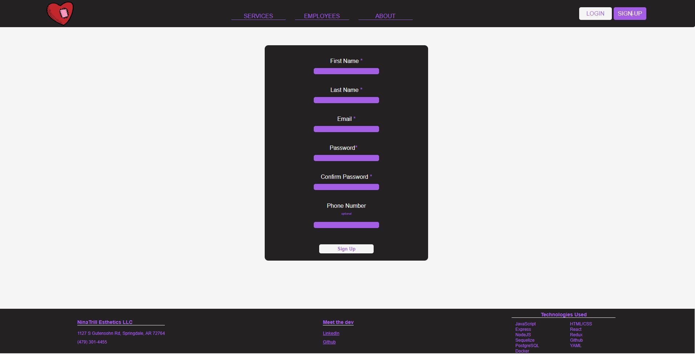
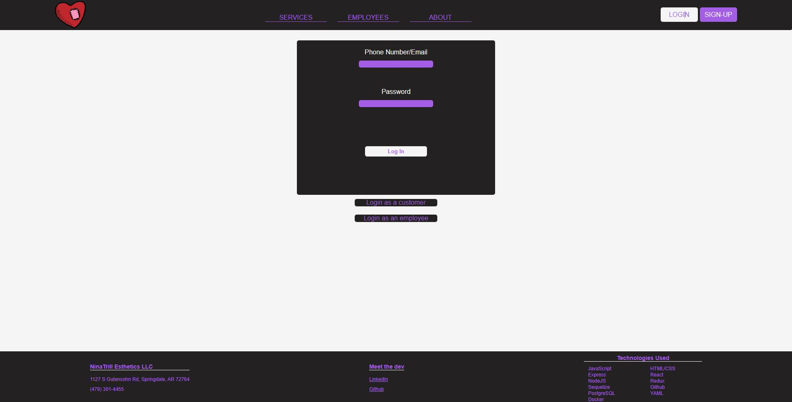
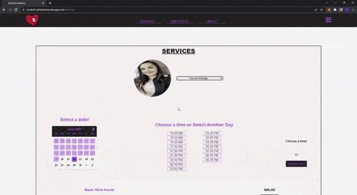
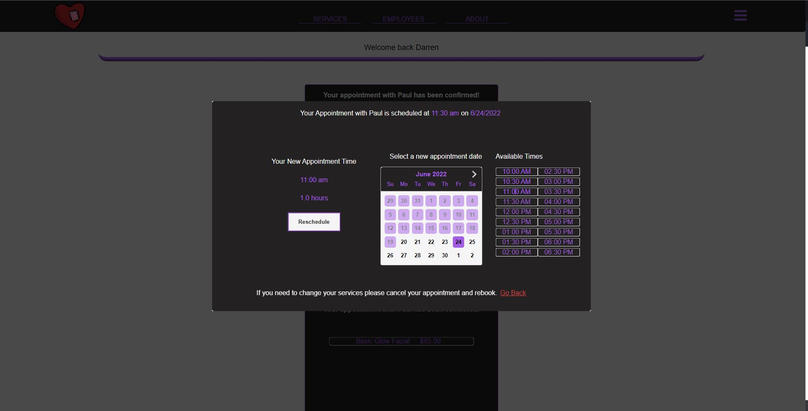
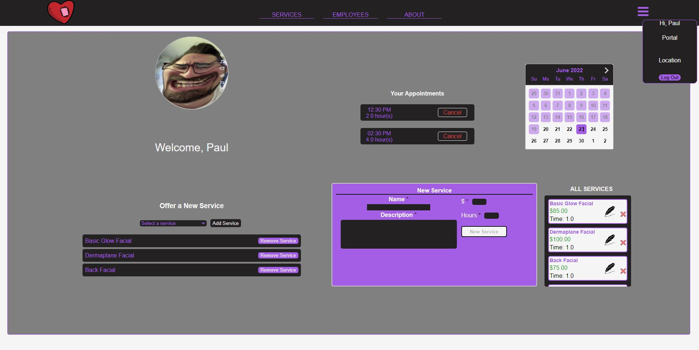

# WELCOME TO NinaTrill Esthetics

Nina Trill Esthetics Live Link: https://ninatrill-esthetics.herokuapp.com/

## Meet the Dev

Chris Treadgill

## Features

NinaTrill is a beta test to an employee management application that will allow small businesses to adjust their employee's schedules, appointments, and their services they offer.  As a customer you will be able to schedule your next appointment with any of the three employees.  Once you have scheduled an appointment you will have access to your customer home page where you will be able to reschedule your appointment with the same employee and services. 

As an employee you will be able to login and view all of your appointments filtered by the date you choose.  Employees will have control over offering a new service. 
Employees will also be able to add services for other employees to offer. 

Users are able to sign up with email/phone number and can use either to log in

Custom booking/sceduling function to adjust and show available appointment times based on employee schedule and appointments.

Customer Appointment Rescheduling

Employee Portal

## Technologies Used

---

 
 

## Future Features

---
## Manager Portal
- This will take away the authority to create new site wide services from regular employees and pass it on to the manager role.

## Schedules
- A manager will be able to change an employee's schedule which will update their available times on the site as well. 

## Time off requests
- An employee will be able to put in for time off which will update their schedule accordingly. 

